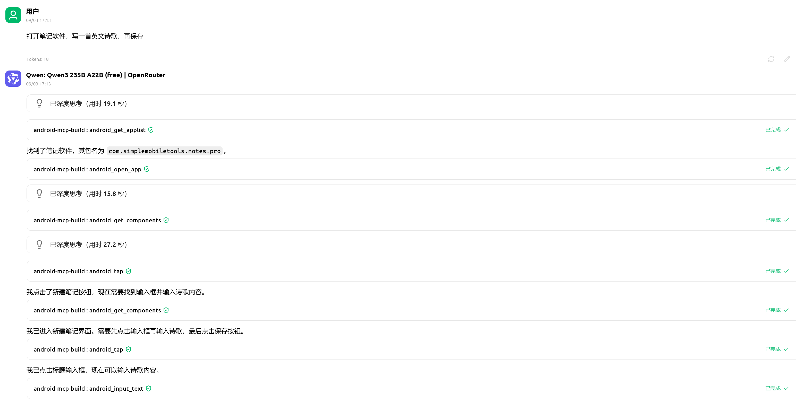

# Android MCP Server

🤖 **Android自动化助手** - 通过自然语言控制你的Android设备

一个基于MCP (Model Context Protocol) 的Android自动化服务器，让你可以用自然语言指令控制Android应用，支持复杂的自动化流程。



---

## 🎯 面向用户 - 快速使用

> 如果你只是想使用Android自动化功能，请看这一部分

### 📦 设备准备

1. **连接设备**: USB连接Android设备或启动模拟器
2. **开启调试**: 设置 > 开发者选项 > USB调试
3. **确认连接**: 运行 `adb devices` 确认设备已连接
4. **授权调试**: 在设备上允许USB调试授权

### 🔧 MCP客户端配置

将以下配置添加到你的MCP客户端设置中， 例如Cursor, Claude Code, CherryStudio(推荐)：

```json
{
  "mcpServers": {
    "android-automation": {
      "command": "npx",
      "args": ["android-mcp"],
      "description": "Android自动化助手"
    }
  }
}
```

### 🤖 使用指南
在 MPC 中使用 Android 自动化助手，只需发送自然语言指令（推荐先使用 [prompt.md](./prompt.md) 预设环境），例如：

- "打开微信并发送"hello world""
- "在浏览器中搜索'AI'并总结页面内容"
- "打开微博首页，截图并保存"

MCP 将自动识别指令并调用相应的 Android 自动化工具。

---

## 🛠️ 面向开发者 - 开发指南

> 如果你想参与开发或本地部署，请看这一部分

### 📋 环境要求

- **Node.js**: 16+ 
- **TypeScript**: 5.0+
- **Android SDK**: ADB工具
- **Python**: 3.7+ (可选，用于uiautomator2增强功能)

### 🚀 快速启动

```bash
# 1. 克隆项目
git clone https://github.com/growvv/Android-Automation-MCP
cd Android-Automation-MCP

# 2. 安装依赖
npm install

# 3. 开发模式运行
npm run dev

# 或者编译后运行
npm run build
npm start
```

### 🔧 MCP客户端开发配置

使用开发配置文件：

```json
{
  "mcpServers": {
    "android-mcp-dev": {
      "command": "npm",
      "args": ["run", "dev"], 
      "cwd": "/path/to/andriod_mcp",
      "description": "开发模式的Android MCP服务器"
    }
  }
}
```

## 📄 许可证

ISC License - 详见 [LICENSE](LICENSE) 文件

## 🙏 致谢

- [Model Context Protocol](https://github.com/modelcontextprotocol) - MCP协议支持
- [uiautomator2](https://github.com/openatx/uiautomator2) - Android自动化核心